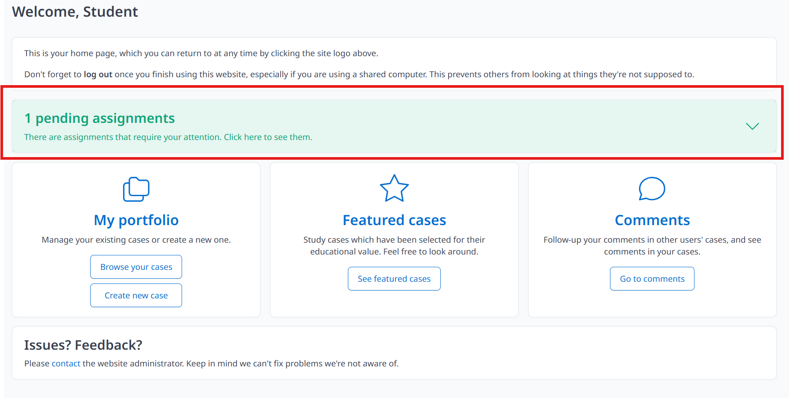

Upon logging into the website, students will receive a notification prompting them to submit the submitted assignments.

<video src={require('./video/studentsubmitassignments.mp4').default} controls></video>

1. Click 'Select case'
2. Select case, click 'submit' and the 'ok' button to confirm your submission.

Students can submit their cases before the due date. 
Notes: The submitted case will be locked till the grading process is finished. 

Students need to click 'complete' when the result is out. They can view their results online when the results is out. 

*Always remember to redact patient personal information, such as case numbers and names.*