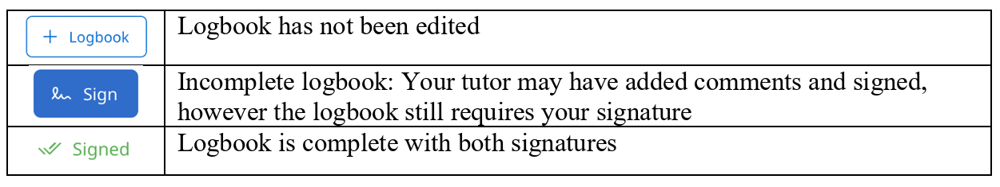
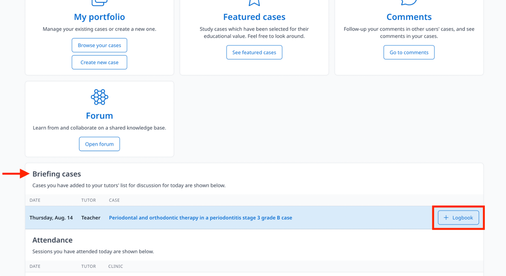
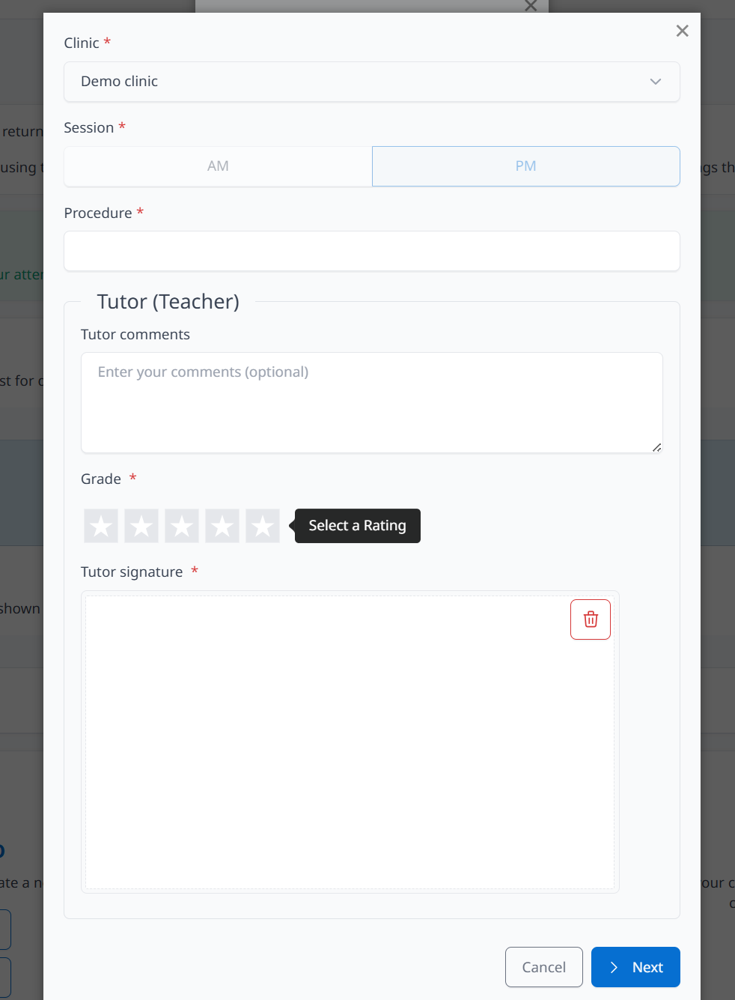
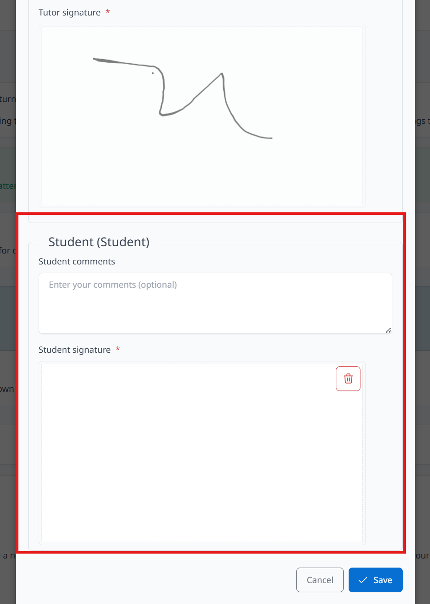
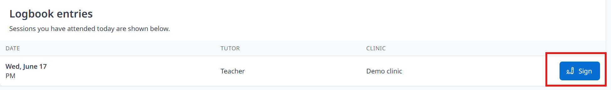
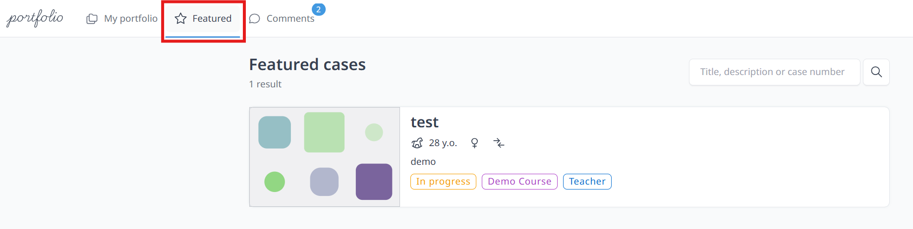
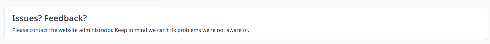

Your portfolio will be based on cases you create.

<video src={require('./video/video1.mp4').default} controls></video>

1. You can [create a case](user-manual/cases/create-a-case.md) and enter the title and description.
2. Create visits for your case.
3.  [upload content](user-manual/cases/upload-content.md) in each visit.

# Attendance and logbook

- Logbook Sign (students are required to have their logbooks signed by teachers). 
- Three type of symbols will be shown depends on status of completion of the logbook.
 

1. Click **Logbook** (next to your submitted case which highlighted in blue under **Briefing cases**. Students have attended will be shown below with details such as date, username of the tutor and the clinic. Once your attendance has been recorded, the session will appear highlighted in blue. 
  

2. Select Clinic, AM/PM session, Procedure, Comments, ask teachers or tutor to fill in comments and sign (This section can also be completed on the tutor’s account, except for the comment and signature parts, which must be handled separately)

3. Students also need to sign the logbook (can also comment) then Click **Save**.

*If you have not signed the logbook, please click the Sign button on your homepage to complete your signature.*

## Featured
Students can view featured cases. Those cases represent outstanding work by other students. These may be used for reference and educational purposes to assist you in developing your own case studies.

1. Click **Featured** on the top left bar or **See featured cases** on home page 
2. Select cases to view

## Forum (wiki?)

## Experiential learning/ Trip reports 

## Issues and Feedback
Section (for both students and teachers) at the bottom of the website, you can send an email for any enquiries. 

