# Getting started

1. Using HKU ID to activate account. (Log in to the portal at https://portfolio.hku.hk/). Alternatively, select 'Other methods' and follow the instructions provided to you by the Faculty Office. 

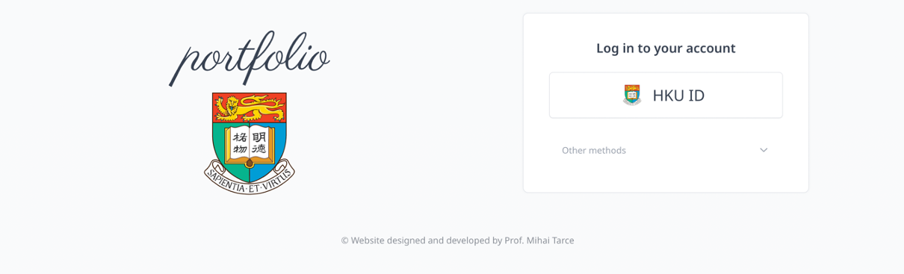
2. In the event that your account is not activated, please indicate your teaching discipline alongside your contract status (e.g., 'Perio' or 'Perio (part-time)') before clicking **Save** and account will soon be activated by the site administrator.

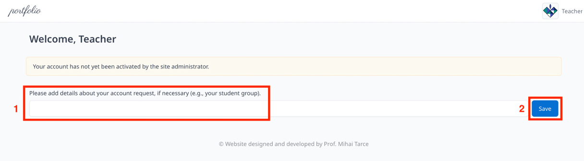

## My portfolio

Teachers can view lists that include cases that they have created, assigned cases to students and creating interactive cases for students learning from each others. Teachers can also edit cases, feature cases, share case by selecting related insightful cases.

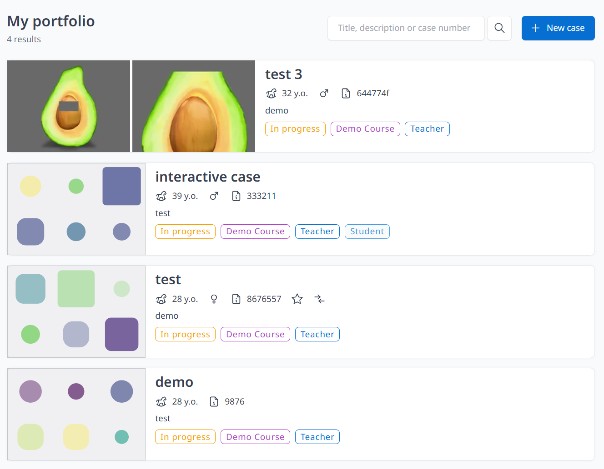

## Search
Allows teachers to search cases. 
 
1. Click **Search** on the left top bar or **Search all cases** on the home page
2. All cases will be shown on the page. Search bar on the left-hand side of the page (can also type title details on the right hand side search corner) on the right hand side) can help teachers to filter the cases. 

Four conditions (status, empty cases, author details and sort by) are provided for filtering cases.

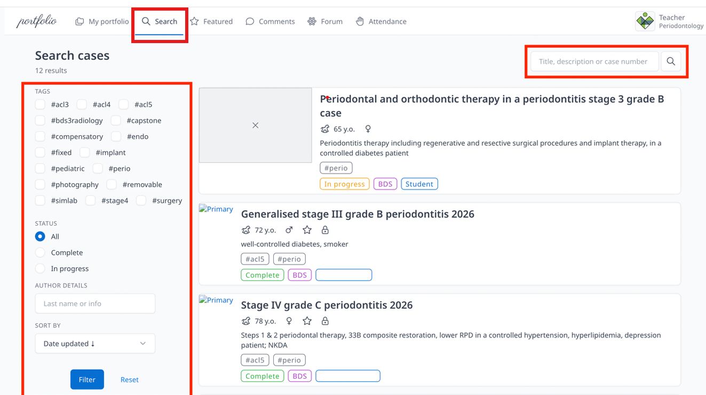

## Featured
If you identify a case as an outstanding learning example and wish to share it with the student body, you may choose to feature it. Please ensure that all student and patient data is completely anonymized before publication.

1. Click **Search** on the left top bar or **Search all cases** on the home page
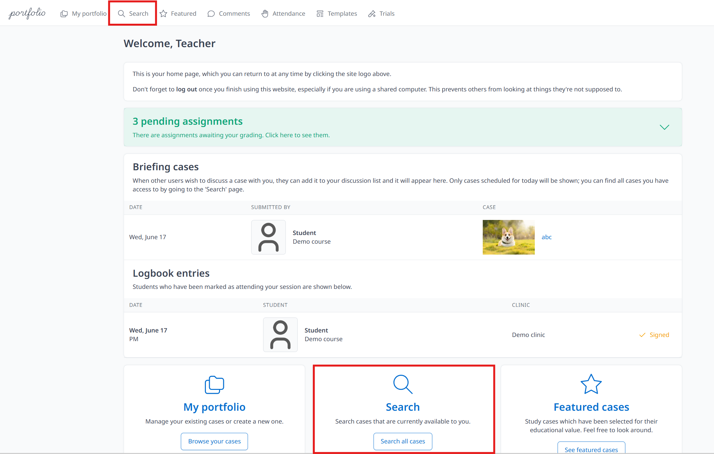

2. Select cases that you wanted to be featured and click to view
3. Click **Feature**, which located in the upper-right corner of the summary section. Click **Unfeature** to undo the featuring

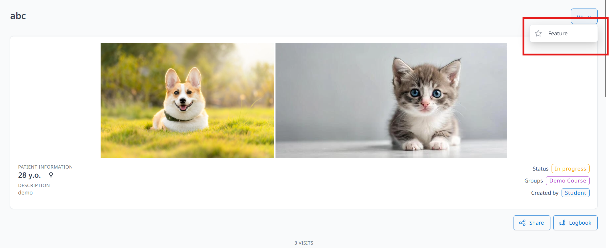

4. Teachers can click **Featured** at the top bar of the page can view all featured cases.

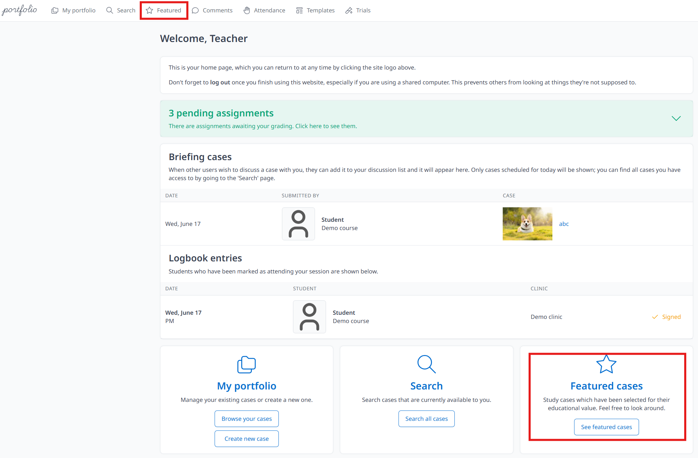

## Templates
Allow teacher create and customize their own template according the needs, adding sections for students to upload different types of files. 

1. Click **Templates** and enter **Title** and **Description**, select **Group**, click **Create**

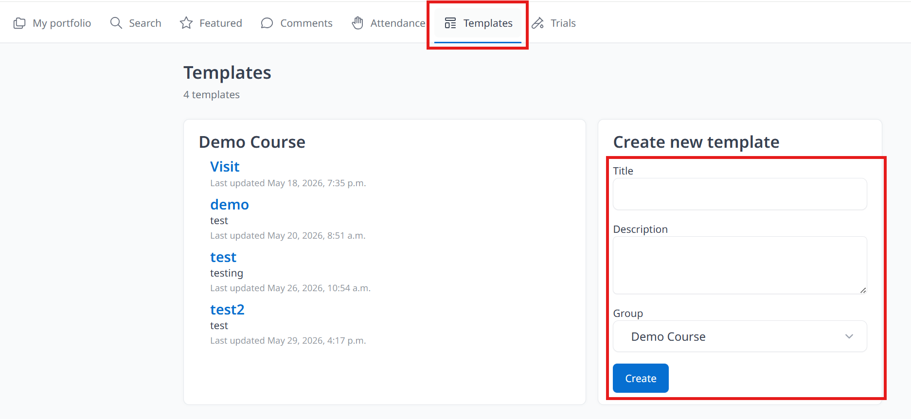

2. You will see **Edit template** and **Sections** after clicking **Create**. Teachers can add sections (enter title and click save changes will find **Add item**, choose type and enter title then save changes)

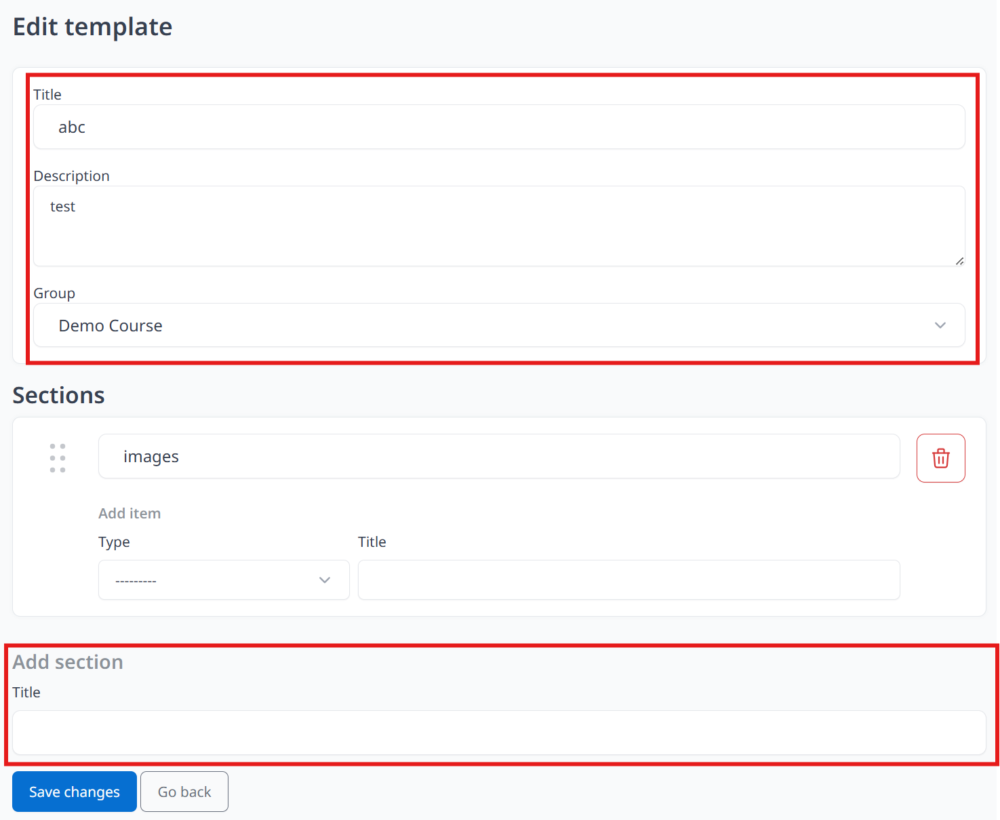

3. Click bin icon to delete sections that you don't need.

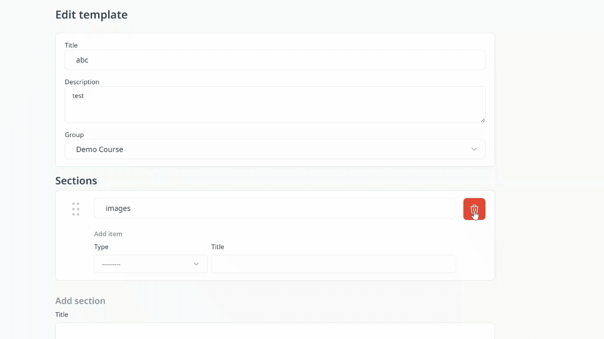

4. Click **Go Back** (remember to Click **Save Changes** first)

## Briefing cases
Cases scheduled for today will be shown and can be viewed by clicking the title.

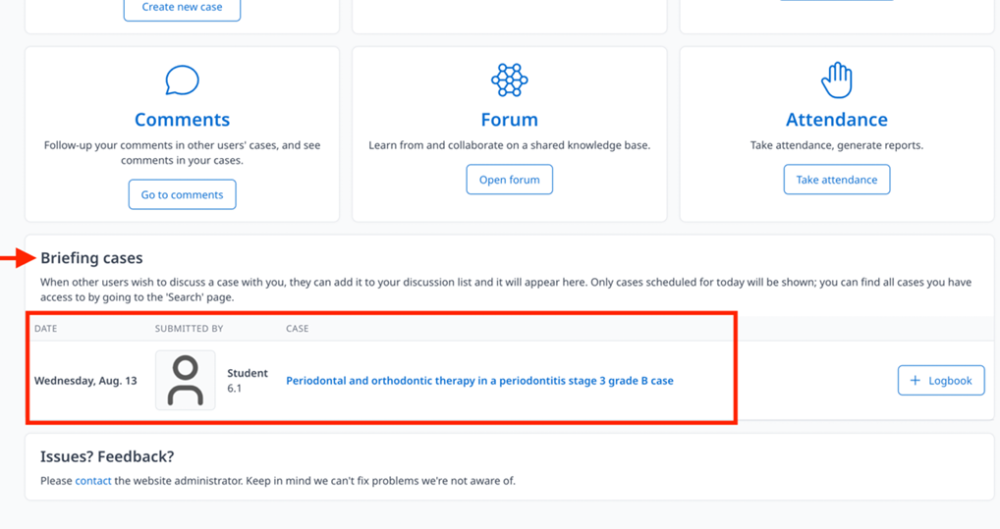

Attendance (on the top left bar or home page)
1. Click **Take attendance** 
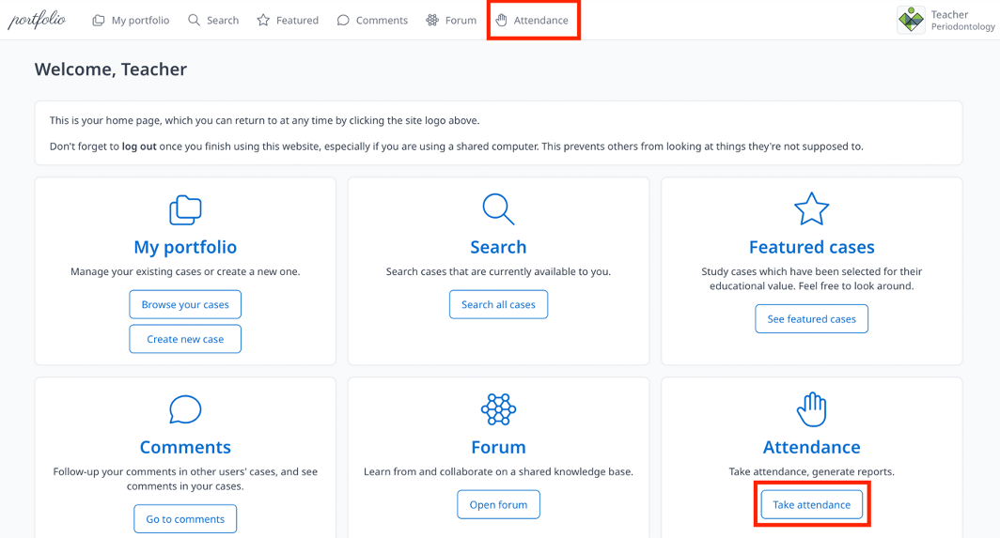

2. Fill in Tutor name, Clinic, Date, AM/PM session, Student group (Should you be unable to find the tutor's name, it may indicate an account issue. Please leave this field empty and notify the Faculty Office)

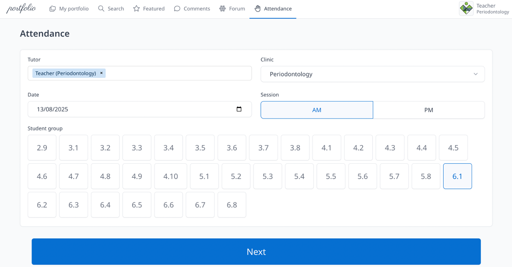

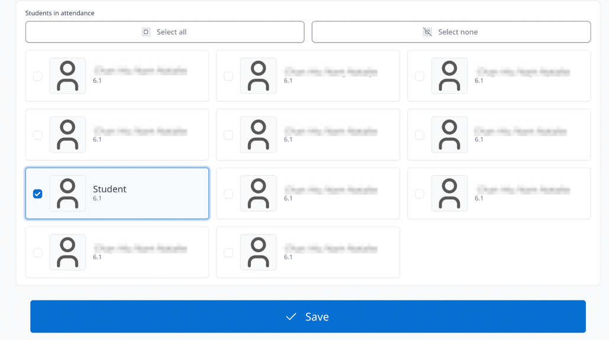

3. Click **Next** and select students by ticking the box
4. Click **Save**

- Logbook Sign (students are required to have their logbooks signed by teachers). 
 Four type of symbols will be shown depends on status of completion of the logbook. 

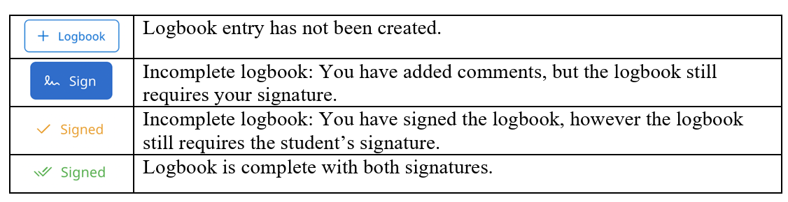

1. Click **Logbook** (next to the each student's name list under **Briefing cases** and **Attendance**)

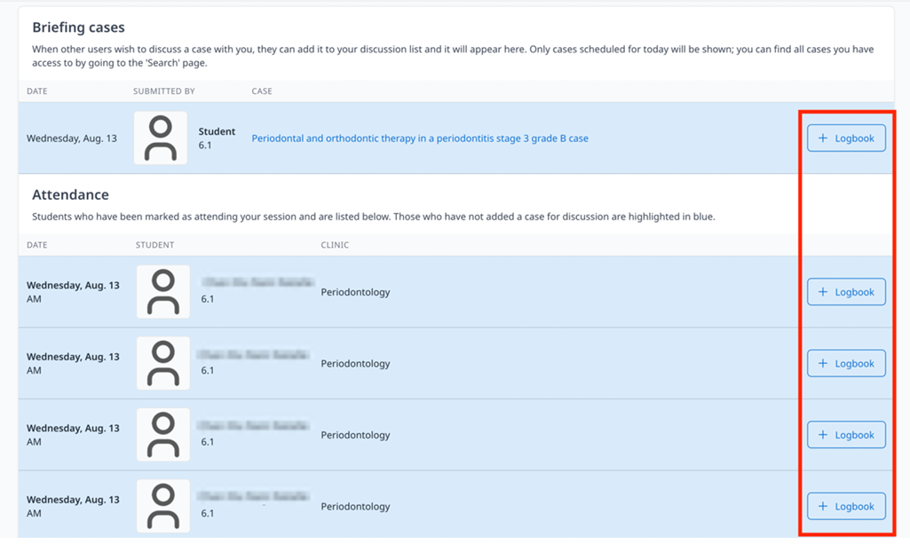

2. Select Clinic, AM/PM session, Procedure, Comments, Grade and sign (Students should input comments before the logbook signed. Contents of the logbook cannot be edited once it gets signed by the teachers/tutors) then click **Save**

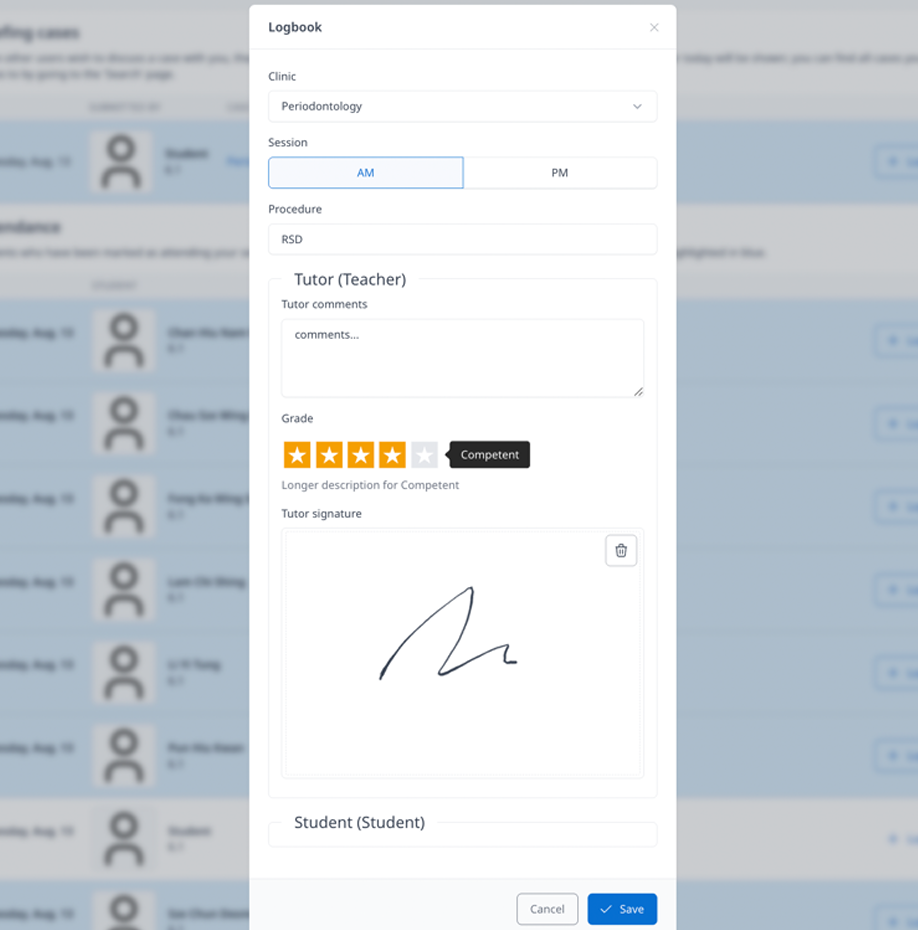

## Trials 

## Report