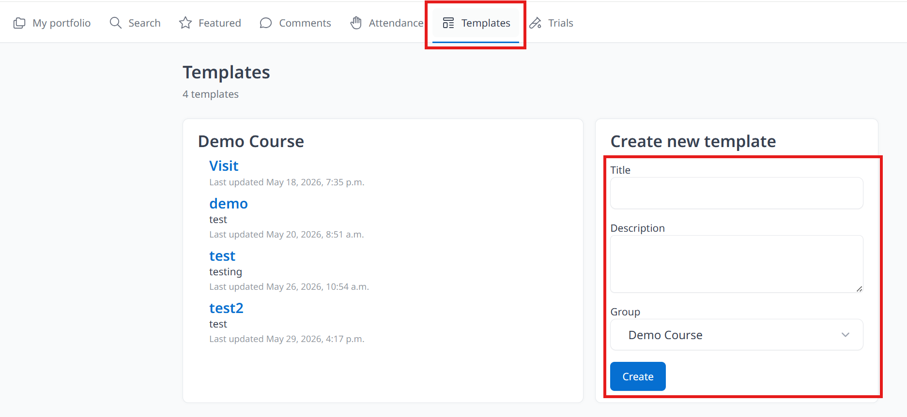
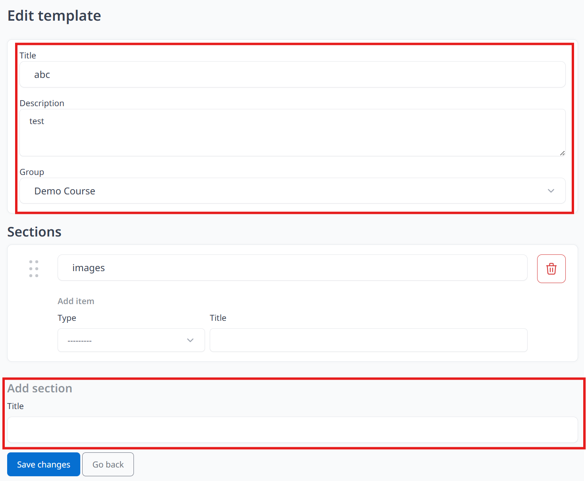
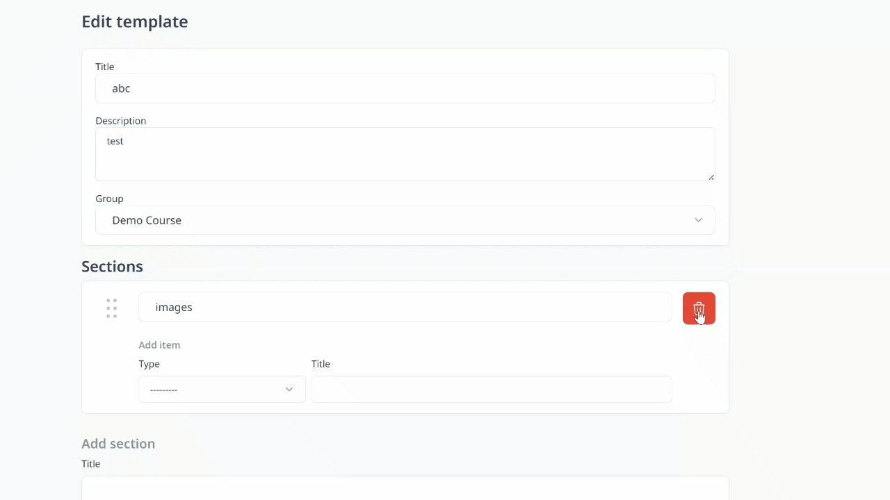

Allow teacher create and customize their own template according the needs, adding sections for students to upload different types of files. 

1. Click **Templates** and enter **Title** and **Description**, select **Group**, click **Create**

2. You will see **Edit template** and **Sections** after clicking **Create**. Teachers can add sections (enter title and click save changes will find **Add item**, choose type and enter title then save changes)

3. Click the bin icon to delete sections that you don't need. 

4. Click **Go Back** (remember to Click **Save Changes** first)