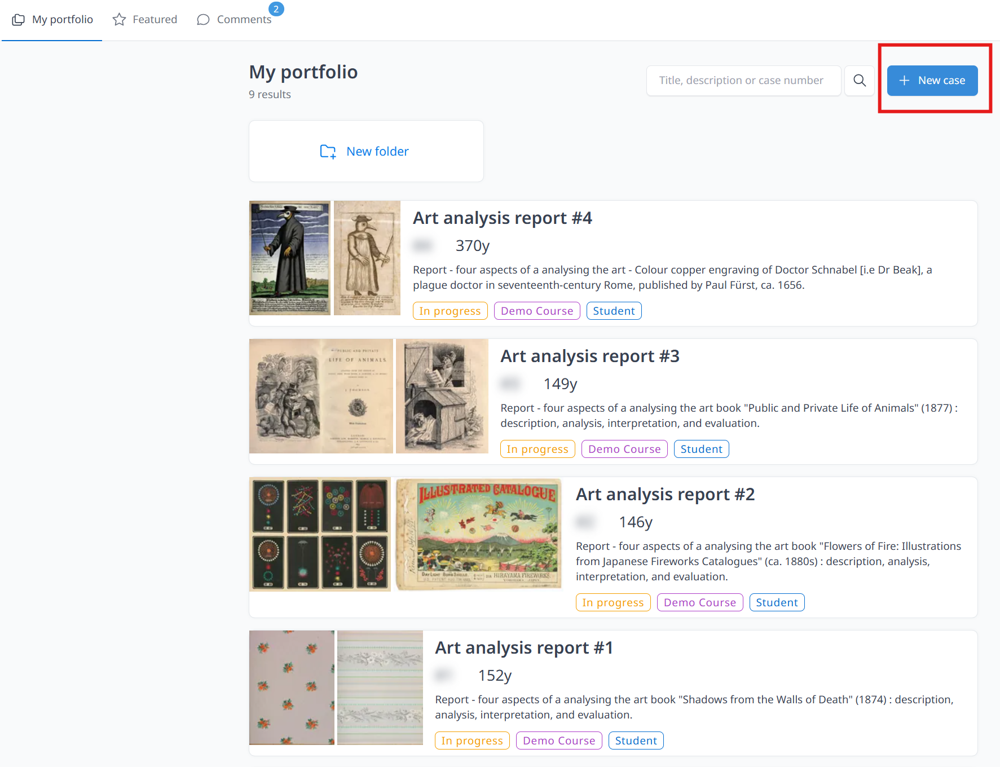
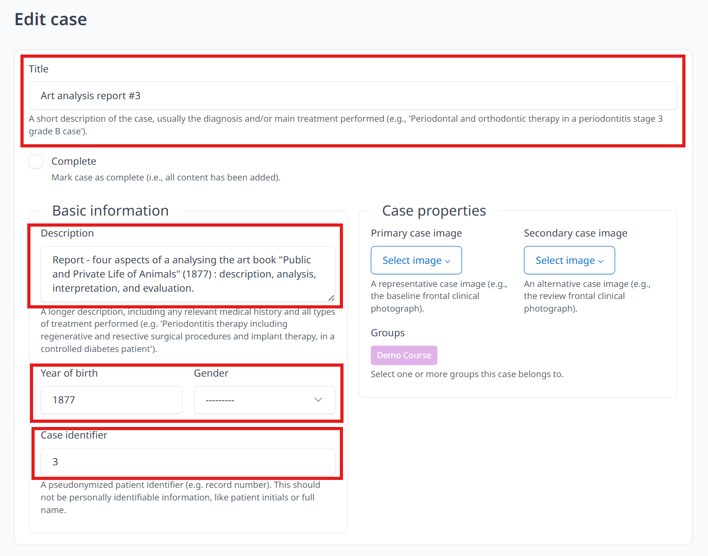
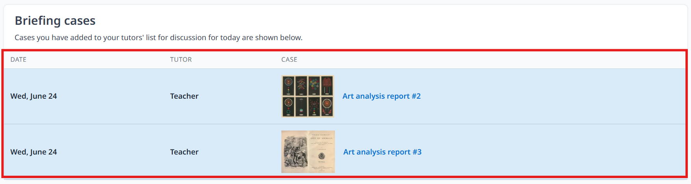

# Create a new case

1. Click **My portfolio**, and click **create new case**, adding title, basic information and case properties (including groups and tags).  (*To ensure data privacy, refraining from entering personally identifiable information (PII), including names and dates of birth, is strictly required*).

 

 

2. Click **+ Create case** and  your cases are created. You can always edit your case details by clicking **Edit case**. **Edit case** can upload document (not media), only for files such as pdf. and docx. 
 
 
3. **Save changes** when you have finished the editing. (*Remember to save your changes frequently to avoid data loss in case of an emergency or system timeout*).
 

## Add tag
Students can add tag to the case by selecting case and clicking edit case, selecting related tag and click **Save changes**.

<video src={require('./video/tag1.mp4').default} controls></video>

## Share case
Cases can be discussed and collaborated by clicking the **Share** button. They can be added to **discussion list** by entering briefing date and Tutor's username. Students can view, comment and share cases to other students so that students can learn from other cases. 

<video src={require('./video/sharevideo1.mp4').default} controls></video>
1. Click **My portfolio**, Select case that you would like to share
2. Click the **Share** button on the right hand side of the page
3. Select date and tutor's name
4. Click **+ Add to discussion list**

Successfully added cases (cases shared to teacher) will be shown on the home page under Briefing cases section. Not only students, teacher (tutor) can also see cases that are scheduled for today’s briefing sessions.

Teachers (only?) can also click **Collaborate**, enter and select name(s) of Collaborators and Click **Save changes**. Students can work or study together with others. Collaborators are able to add, change and delete content. **Collaborate** mostly used when referring a case for a specific procedure (e.g., surgery) or when a case requires a multidisciplinary treatment approach.

## Create folder

You can also create folder to categorize different cases.
