# Create a new case

1. Click **My portfolio**, and click **create new case**, adding title, basic information and case properties (including groups and tags).  (*To ensure data privacy, refraining from entering personally identifiable information (PII), including names and dates of birth, is strictly required*).

 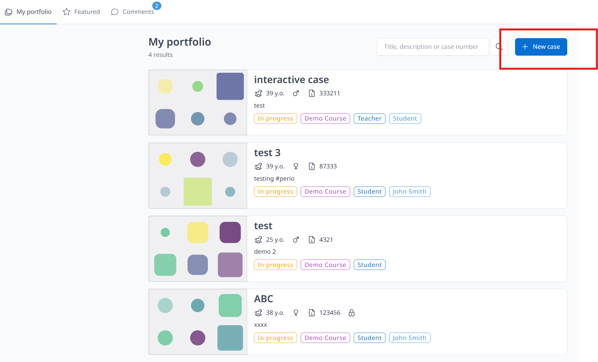

 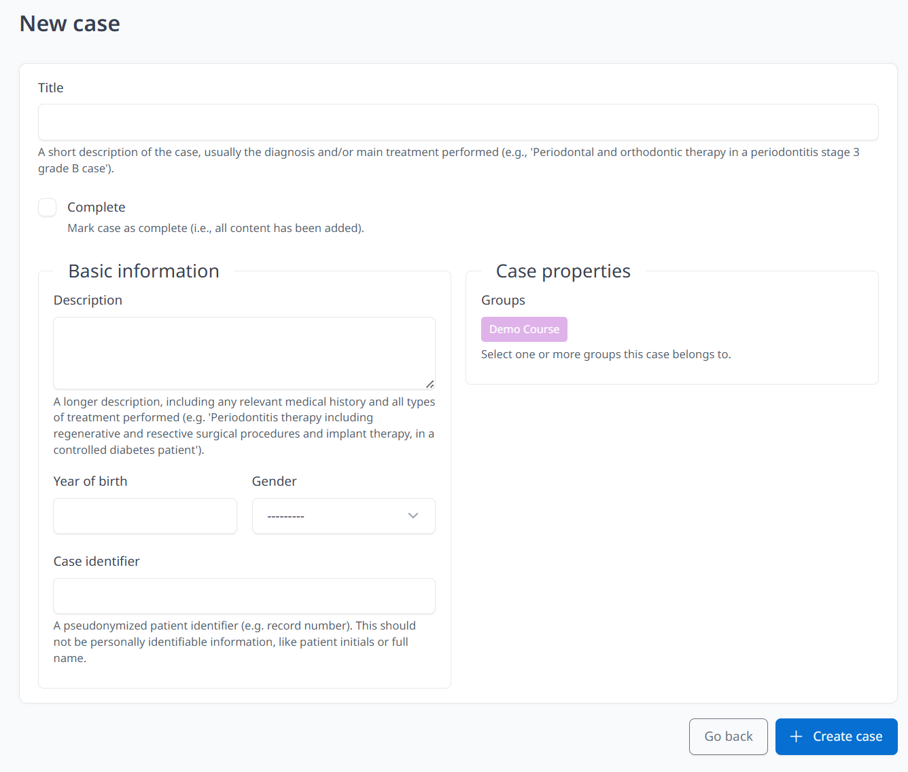

2. Click **+ Create case** and  your cases are created. You can always edit your case details by clicking **Edit case**. **Edit case** can upload document (not media), only for files such as pdf. and docx. 
 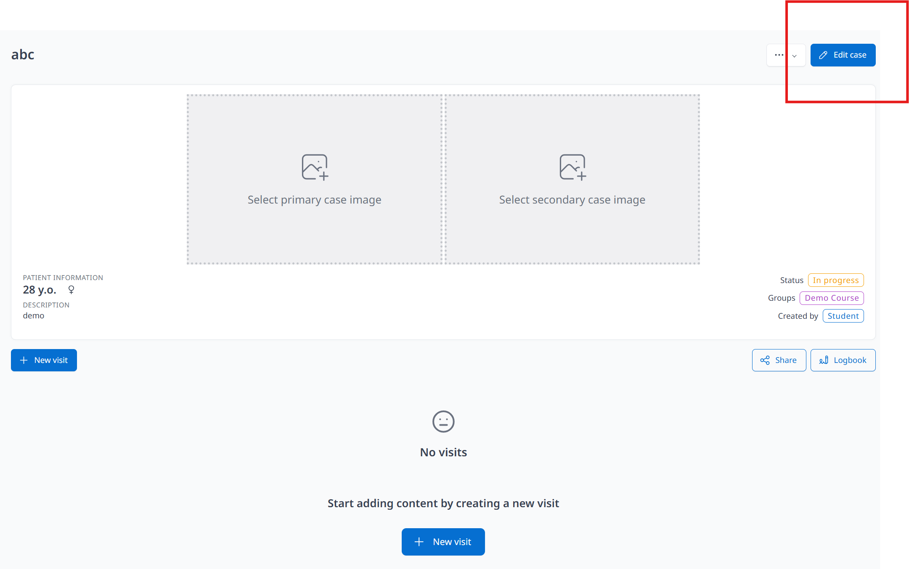
 
3. **Save changes** when you have finished the editing. (*Remember to save your changes frequently to avoid data loss in case of an emergency or system timeout*).
 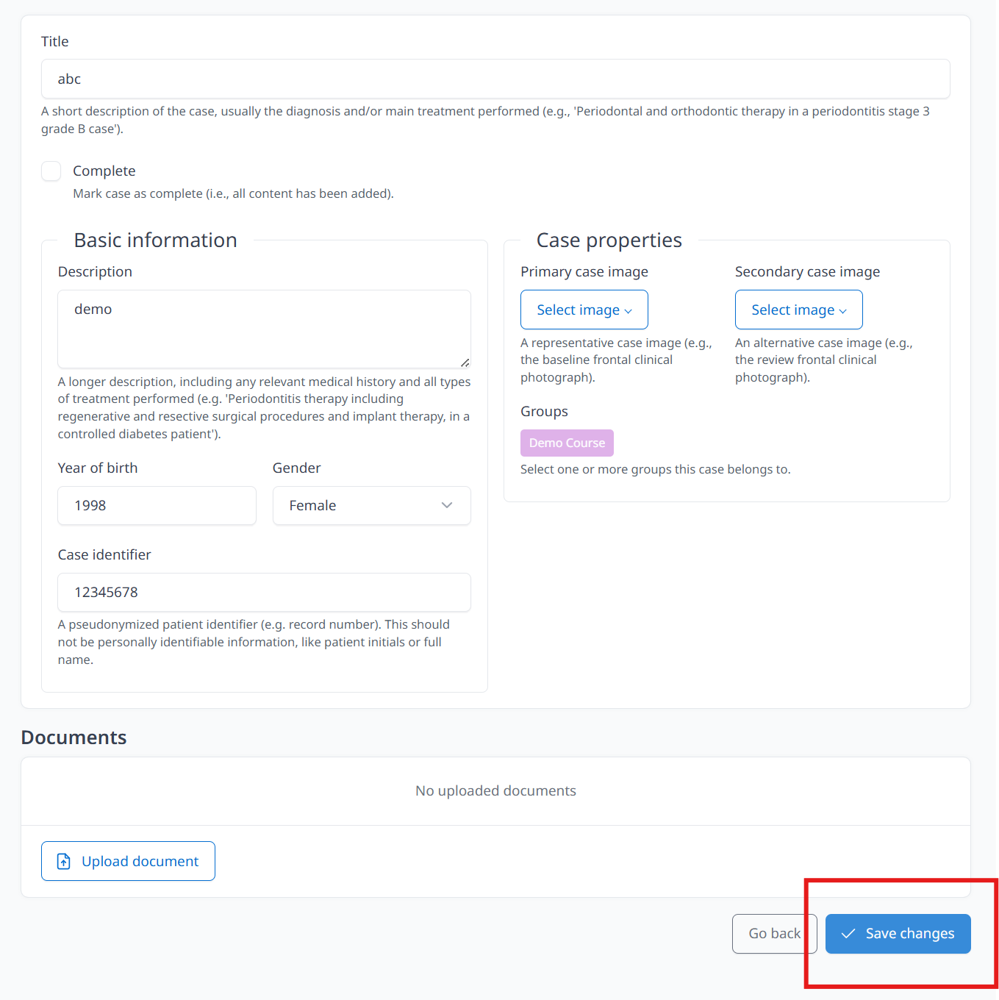

4. Click **+ New visit** once your case is created. (*also applicable when adding a visit to an existing case*)
 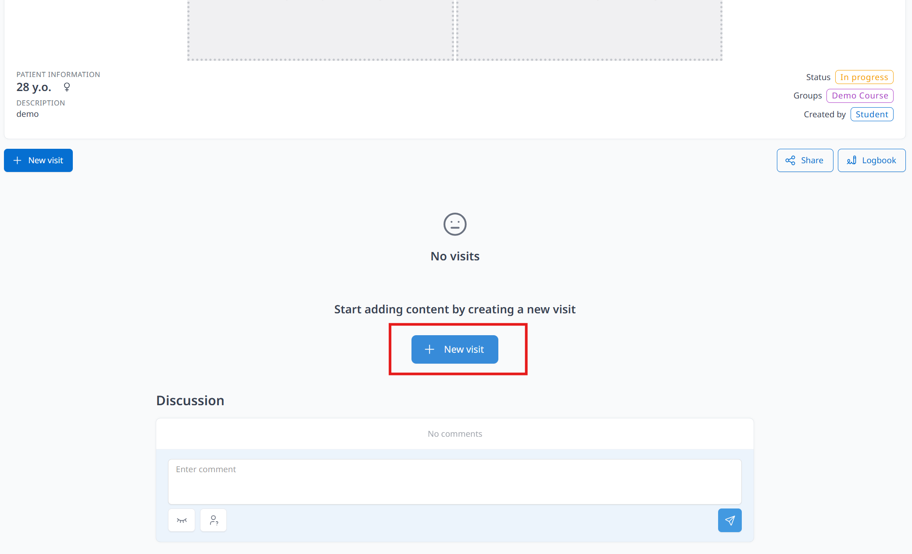

5. Select visit date and template, Click **Create**. (*Notes for selecting template: As a general rule, the 'Oral Diagnosis and Treatment Planning' template should be used for new cases, while the 'Visit' template must be utilized for documenting procedures and follow-up appointments. Students are advised to consult their tutor first to ensure accuracy*).

 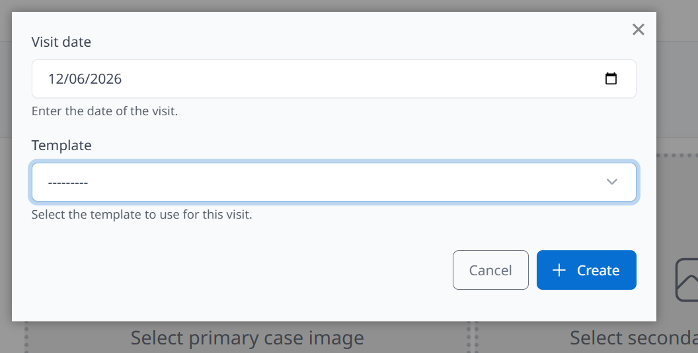

6. Click **Edit visit** to edit contents and details of the case (including visit date and title) and upload files or DICOM folder. (*Important: All personally identifiable information (e.g., name, date of birth) must be strictly redacted*).

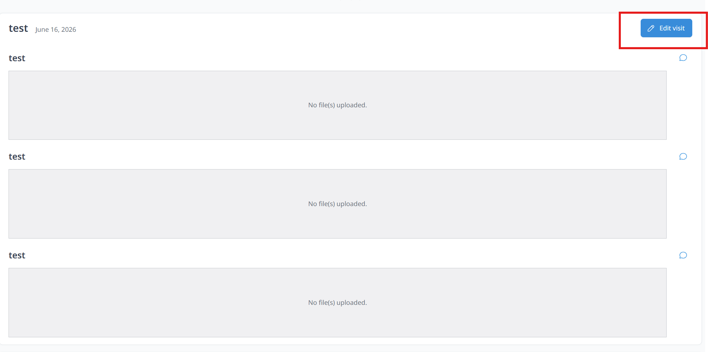

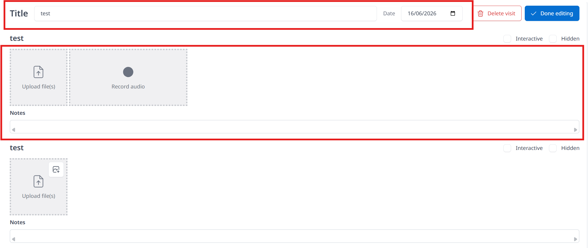

7. Students can delete visit by clicking **Edit visit** then click **Delete visit**. 

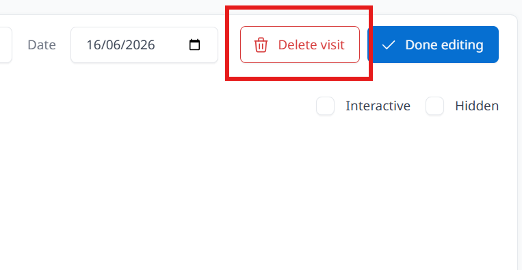

A confirmation dialog box will appear, click **Cancel** or **Confirm**  to proceed.

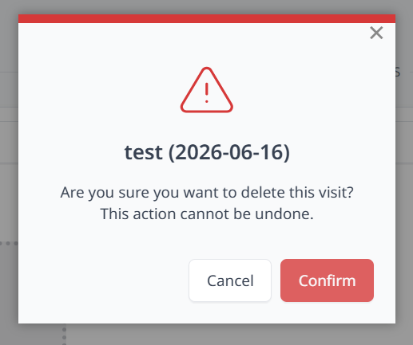

8. Students can record audio and upload DICOM folder, 3D files and documents (refer to different sections) Under **Summary** (on the left side) show different sections. 

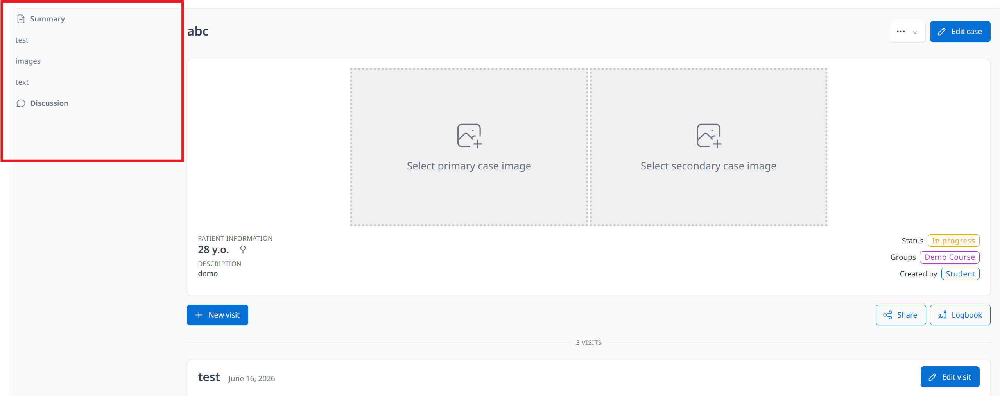

9. Click **Upload file(s)** to upload images and documents.
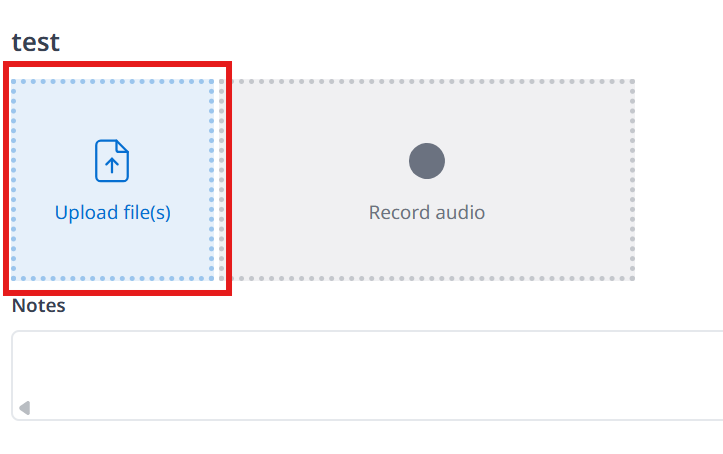
10. You can also click the upper right side small box inside the **upload file(s)** to upload images in three different ways. (*Supported data formats: JPEG, PDF*). Students can click **Select an existing image** to make a copy of the uploaded image and edit it.

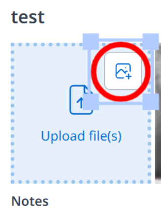

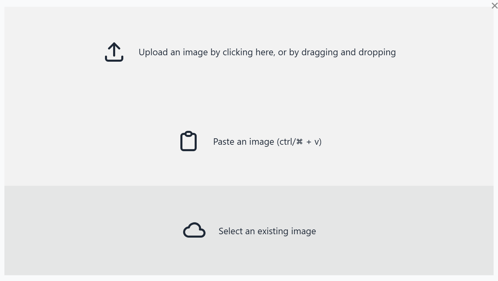

An image editing panel will appear once the file has been successfully uploaded. **Students can crop image or click the rectangle icon to add and move the rectangle for covering patient personal information**. Functions of the editing panel include: Orient, Crop, Adjust Brightness and Contrast, different markers for highlighting important findings and insert rectangle for covering. Students can also  add annotations by click the "Aa" icon. Remember to click **Save** all the time. 

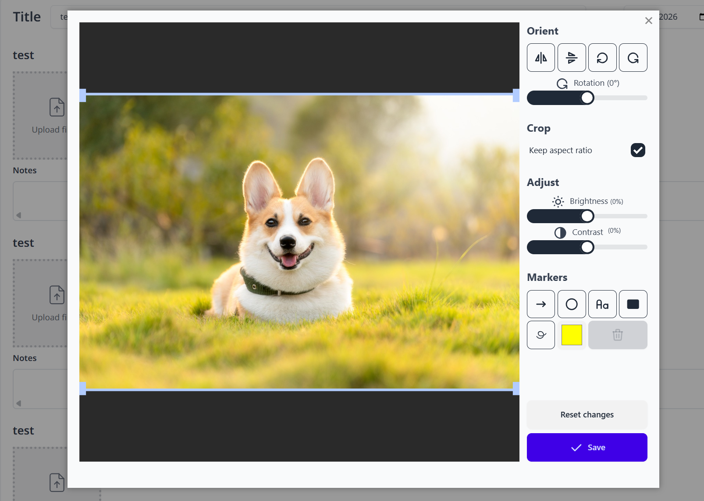

Click **Done editing** to save changes.
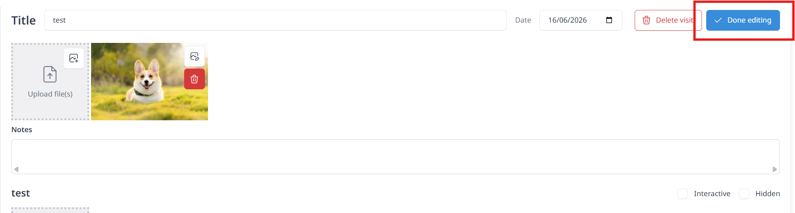

Students can add description and comments of images by just clicking the uploaded image. Click the pencil icon button on the upper righthand side of the page then you are free to enter texts, remember to click the checkmark icon button once you have finished editing.

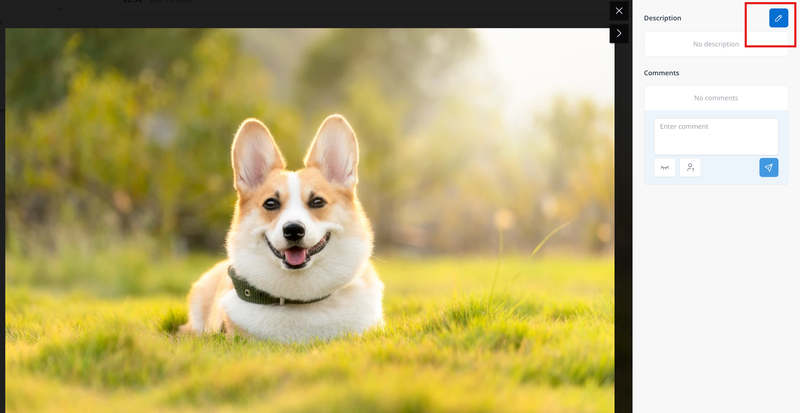

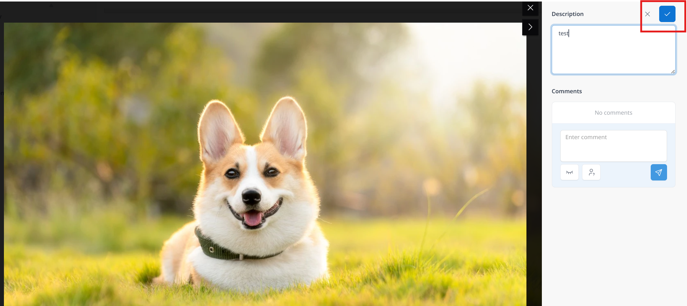

To hide sections that are irrelevant to the case, click **Edit visit**, then tick the **hidden** box located at the upper right side of the section. Remember to click **Done editing** after changes.

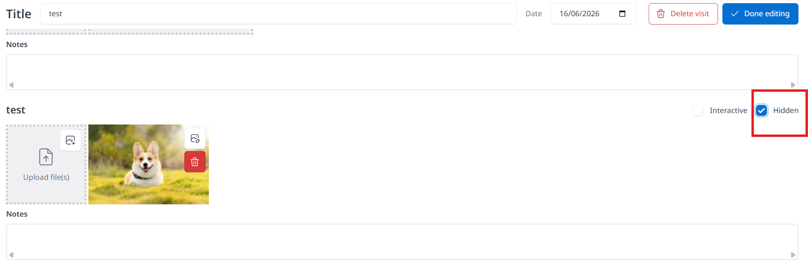

Students can click **Edit case** to tick the **Complete** box when all contents has been added and revised. 

**Representative case images**: Once all photographs are uploaded, please select two key images to represent the case. Standard selections include the frontal clinical view and a panoramic radiograph, or 'before and after' frontal views for *finalized cases*. 

These images will be displayed as thumbnails to streamline case and to ensure that all required primary and secondary case images are uploaded and properly selected in their respective summary sections. 

1. Click **Edit case** at the top right side of the case page
2. Click **Select image** under the Case properties
3. Selected images will be highlighted in blue. Click **Save changes** after two representative case images are selected. 

## Share
Cases can be discussed and collaborated by clicking the **Share** button. They can be added to **discussion list** by entering briefing date and Tutor's username. Students can view, comment and share cases to other students so that students can learn from other cases. 

1. Click **My portfolio**, Select case that you would like to share
2. Click the **Share** button on the right hand side of the page
3. Select date and tutor's name
4. Click **+ Add to discussion list**

Successfully added cases will be shown on the home page under Briefing cases section. Not only students, teacher (tutor) can also see cases that are scheduled for today’s briefing sessions.

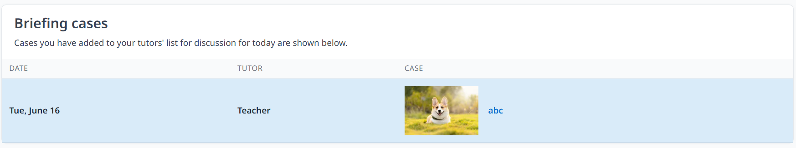

Teachers (only?) can also click **Collaborate**, enter and select name(s) of Collaborators and Click **Save changes**. Students can work or study together with others. Collaborators are able to add, change and delete content. **Collaborate** mostly used when referring a case for a specific procedure (e.g., surgery) or when a case requires a multidisciplinary treatment approach.

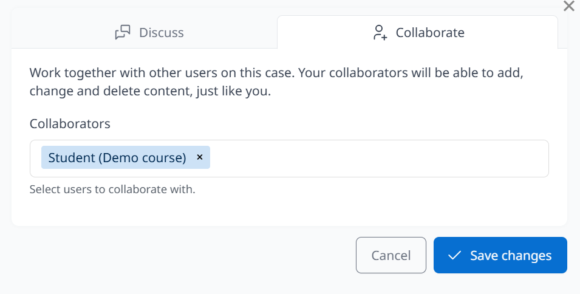
