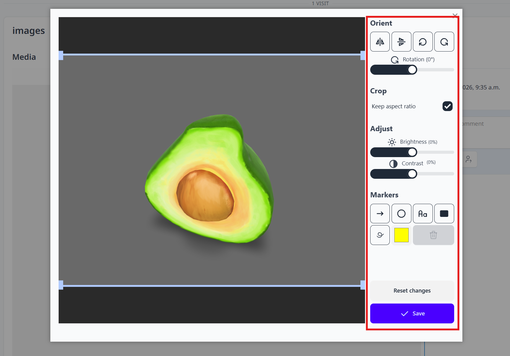
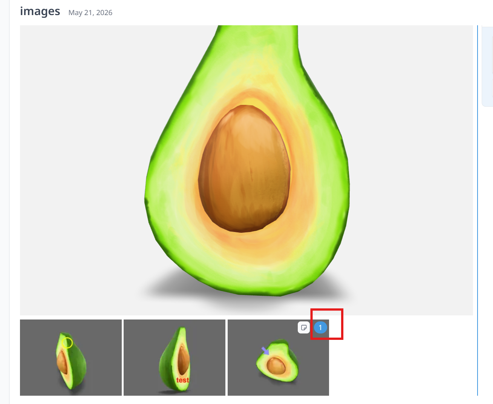
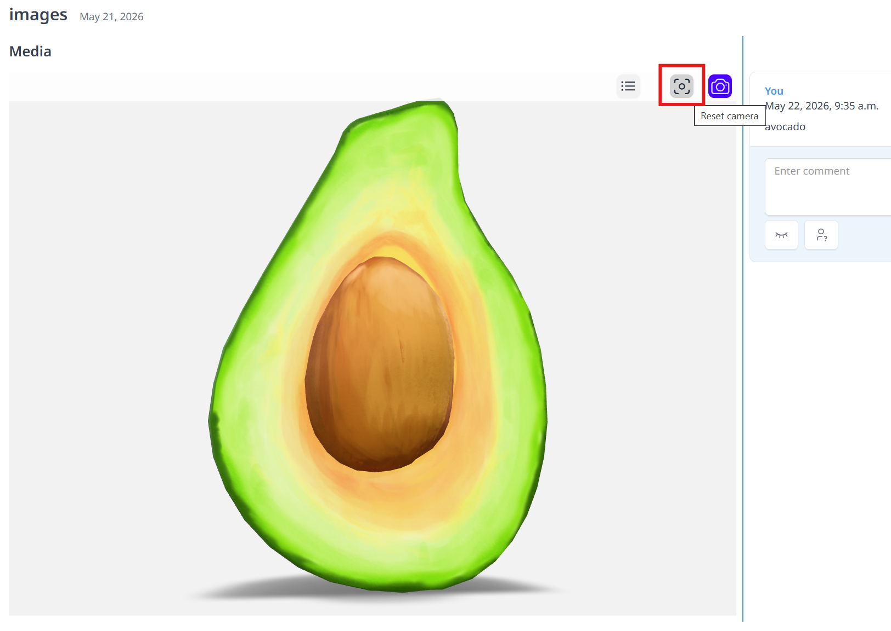
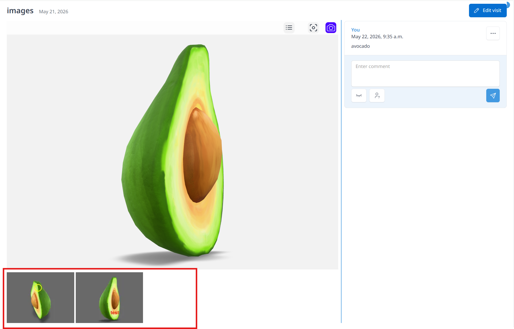
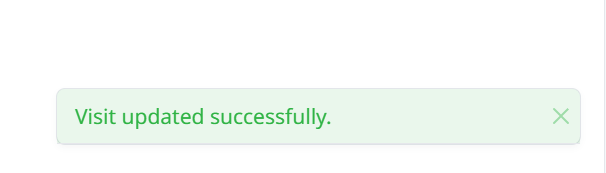

# Upload content

Students can upload different types of media such as ply. file (with 3D viewer to view after students have finish uploading), dcm. file (DICOM), jpg. file. students can add comment on each section (right hand side), comments can be edited, deleted and resolved. 

For 3D model (AR), students can view and take screenshot of the glb. file and edit it (Orient, Crop, Adjust Brightness and Contrast, different markers for highlighting important findings) by using image editing panel. 

Click **Save** when students finish the editing and the revised screenshot will be shown below the file section, students can enter notes, description and comments for the image. 

When new comments are added to the picture, a blue circle containing the total comment count will be displayed.

Histology photos can also be screenshotted and edited. Students are able to zoom in and out once the files are successfully uploaded. 

User can freely to rotate, scale (zoom in/out), and thoroughly inspect the 3D model from any orientation. 

User can reset camera by clicking the upper right button of the section. 

User can also edit or cap a screenshot from different view of the model by clicking the upper right button of the section. 
 

Edited screenshots will be shown under the 3D model viewer. 

> File types that can be uploaded: (a) Charting (b) Images - under section "Clinical photographs" *Supported data formats: JPEG, PNG, BMP*. (c) Images, Radiographs - under section "Panoramic radiograph" and "Intraoral radiographs" *Supported data formats: JPEG, PNG, BMP*. (d) 3D files - under section "Intraoral scan" *Supported data formats: STL, PLY*.

A **Visit updated successfully** notification will appear in the bottom-right corner once your files or media have been successfully uploaded and saved. 

 

See an image here:

and a video here:

<video src={require('./video/penguin.mp4').default} controls></video>