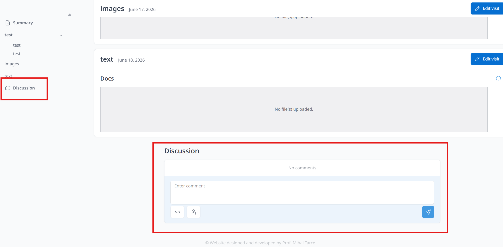
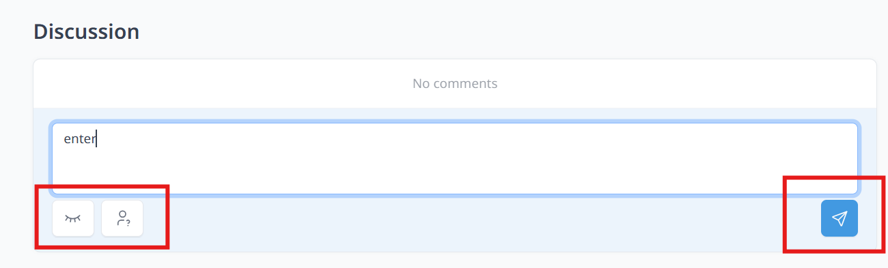
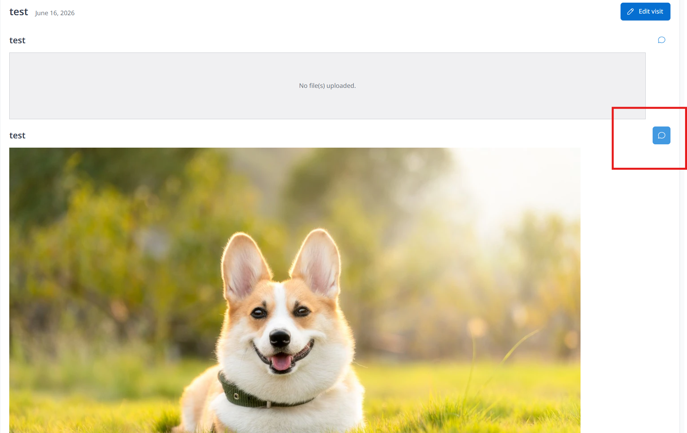
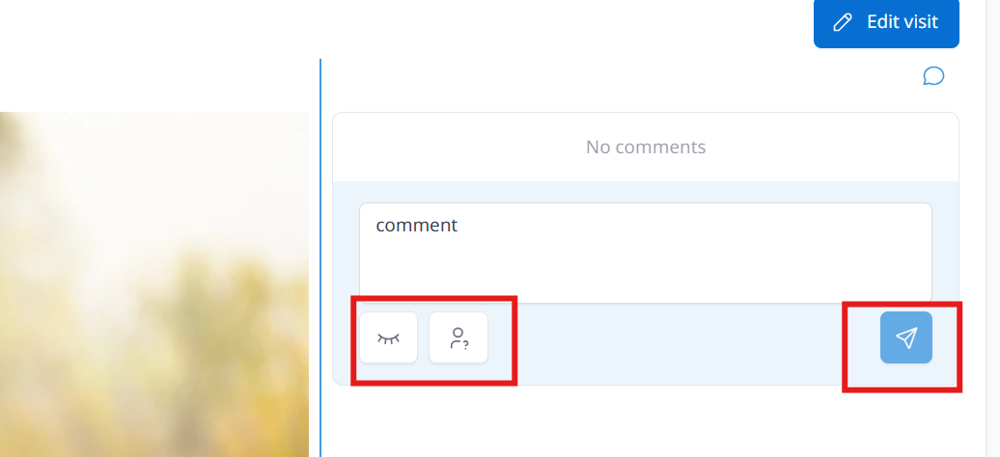
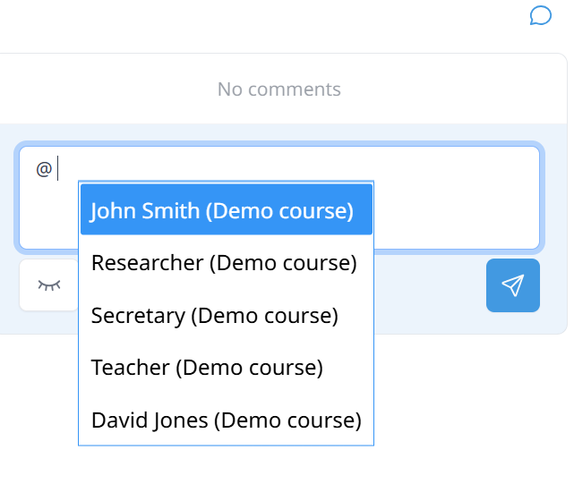
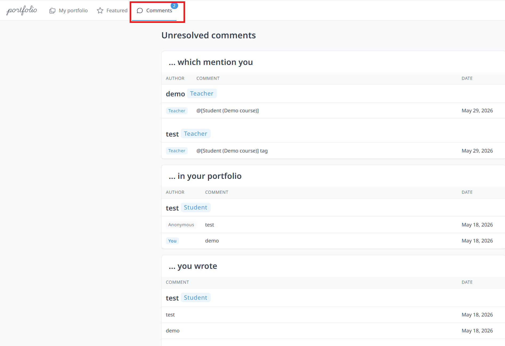
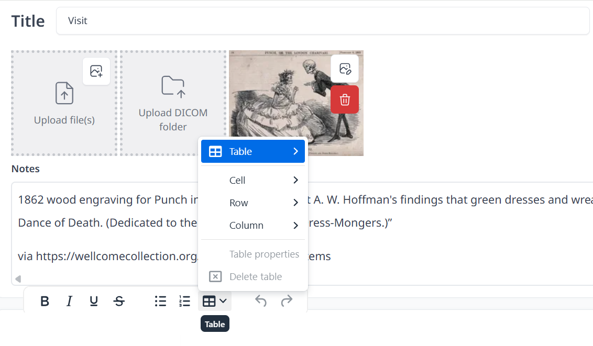

# Introduction

Some *more* text here...

:::caution

A warning here

:::

## Comment and mention functions
Students can leave comments or ask questions throughout the case or comment on a specific case section. Comment can be added openly or anonymously. You can also add personal notes for personal use only.

**For leaving overall feedback:**
Bottom of the case page is the **Discussion** part. Students are able to enter comment (for personal notes or comment anonymously)
 

Enter comment, tick box (**Personal note** or **Post anonymously**) if necessary and Click send icon.

 

**For leaving comment on some specific case section:**
1. Click the conversation bubbles icon at the upper right corner on each section
 

2. Enter comment, tick box (**Personal note** or **Post anonymously**) if necessary and Click send icon
 

(Not sure for students account) For tagging users in comment:
1. Type "@" followed by the name
2. Click the name in highlighted blue
3. Enter messages and click send icon
 

Students can view and check all comments and tags or mentions by clicking **Comment** at the top bar. The following notification will be displayed if someone comments on your post or tags you.

You may also add notes to the image. Not only adding texts, you can create a table.

